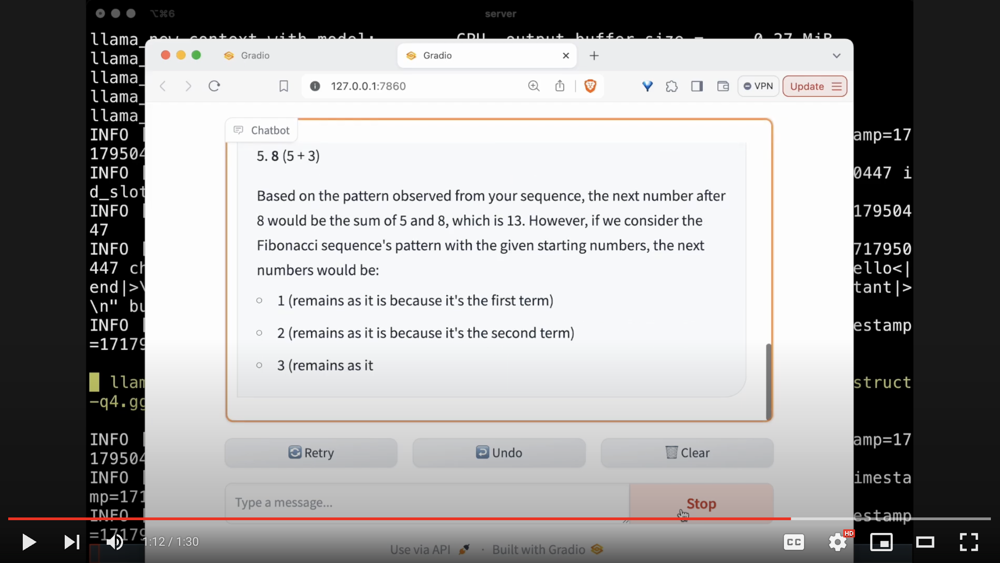

# llamanet gradio demo

A localized version of a basic OpenAI Gradio Chat app, powered by [llamanet](https://github.com/pinokiocomputer/llamanet)

Watch the video to see what it looks like when running:

[](https://www.youtube.com/watch?v=PN5cEi7GqAE)

## Install

### 1. Activate venv

First activate venv.

On Windows:

```
python -m venv env
env/Scripts/activate
```


On Linux/Mac:

```
python -m venv env
source env/bin/activate
```

### 2. Install dependencies

```
pip install -r requirements.txt
```

## Run

```
python app.py
```
